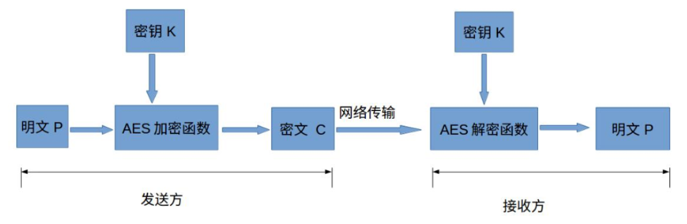

# AES简介

高级加密标准（英语：Advanced Encryption Standard，缩写：AES），在密码学中又称Rijndael加密法，是美国联邦政府采用的一种区块加密标准。这个标准用来替代原先的DES，已经被多方分析且广为全世界所使用。经过五年的甄选流程，高级加密标准由美国国家标准与技术研究院（NIST）于2001年11月26日发布于FIPS PUB 197，并在2002年5月26日成为有效的标准。2006年，高级加密标准已然成为对称密钥加密中最流行的算法之一。

AES加密有AES-128、AES-192、AES-256三种，分别对应三种密钥长度128bits（16字节）、192bits（24字节）、256bits（32字节）。当然，密钥越长，安全性越高，加解密花费时间也越长。默认的是AES-128，其安全性完全够用。

AES算法为最常见的对称加密算法(微信小程序加密传输就是用这个加密算法的)。对称加密算法也就是加密和解密用相同的密钥，具体的加密流程如下图：

AES只是个基本算法，实现AES有几种模式，主要有ECB、CBC、CFB和OFB这几种（其实还有个CTR）：

1. ECB模式（电子密码本模式：Electronic codebook） 
    ECB是最简单的块密码加密模式，加密前根据加密块大小（如AES为128位）分成若干块，之后将每块使用相同的密钥单独加密，解密同理。

2. CBC模式（密码分组链接：Cipher-block chaining） 
    CBC模式对于每个待加密的密码块在加密前会先与前一个密码块的密文异或然后再用加密器加密。第一个明文块与一个叫初始化向量的数据块异或。

3. CFB模式（密文反馈：Cipher feedback） 
    与ECB和CBC模式只能够加密块数据不同，CFB能够将块密文（Block Cipher）转换为流密文（Stream Cipher）。

4. OFB模式（输出反馈：Output feedback） 
    OFB是先用块加密器生成密钥流（Keystream），然后再将密钥流与明文流异或得到密文流，解密是先用块加密器生成密钥流，再将密钥流与密文流异或得到明文，由于异或操作的对称性所以加密和解密的流程是完全一样的。