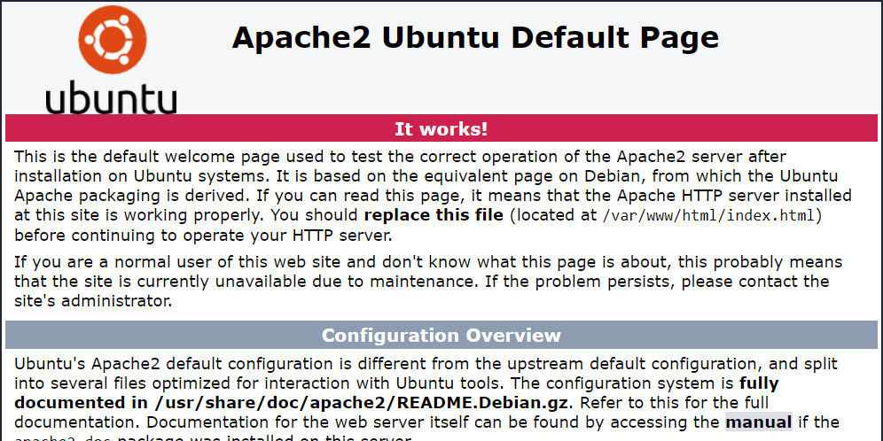
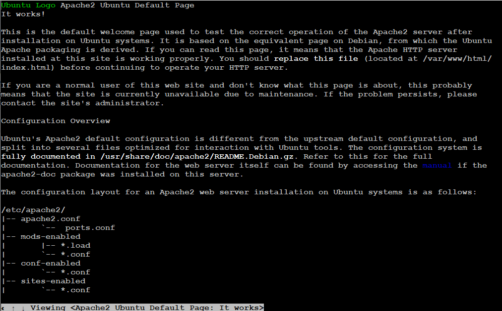

## apache 安装
### ubuntu server
1、更新高级软件包工具（最近更新过可忽略）
```
sudo apt-get update
```
2、安装
```
sudo apt-get install apache2
```
测试是否成功（成功的话会出现apache的说明）:

- 本地测试: 在浏览器中输入 localhost
- 它机测试：在它机浏览器输入服务器IP

如果成功可以看到以下所示网页


1.可以在ubuntu安装一个 w3m 文字式网页浏览器,执行以下命令：
```
sudo apt-get install w3m
```
2.执行
```
w3m localhost
```
出现一下页面，则apache 配置成功


3、配置

官方配置说明

**Configuration Overview**

Ubuntu's Apache2 default configuration is different from the upstream default configuration, and split into several files optimized for interaction with Ubuntu tools. The configuration system is fully documented in */usr/share/doc/apache2/README.Debian.gz*. Refer to this for the full documentation. Documentation for the web server itself can be found by accessing the manual if the apache2-doc package was installed on this server.

The configuration layout for an Apache2 web server installation on Ubuntu systems is as follows:
```
/etc/apache2/
|-- apache2.conf
|       `--  ports.conf
|-- mods-enabled
|       |-- *.load
|       `-- *.conf
|-- conf-enabled
|       `-- *.conf
|-- sites-enabled
|       `-- *.conf
```  

- *apache2.conf* is the main configuration file. It puts the pieces together by including all remaining configuration files when starting up the web server.
- *ports.conf* is always included from the main configuration file. It is used to determine the listening ports for incoming connections, and this file can be customized anytime.
- Configuration files in the *mods-enabled/*, *conf-enabled/* and *sites-enabled/* directories contain particular configuration snippets which manage modules, global configuration fragments, or virtual host configurations, respectively.
- They are activated by symlinking available configuration files from their respective *-available/ counterparts. These should be managed by using our helpers a2enmod, a2dismod, a2ensite, a2dissite, and a2enconf, a2disconf . See their respective man pages for detailed information.
- The binary is called apache2. Due to the use of environment variables, in the default configuration, apache2 needs to be started/stopped with /etc/init.d/apache2 or apache2ctl. Calling /usr/bin/apache2 directly will not work with the default configuration.

**Document Roots**

By default, Ubuntu does not allow access through the web browser to any file apart of those located in /var/www, public_html directories (when enabled) and /usr/share (for web applications). If your site is using a web document root located elsewhere (such as in /srv) you may need to whitelist your document root directory in /etc/apache2/apache2.conf.

The default Ubuntu document root is /var/www/html. You can make your own virtual hosts under /var/www. This is different to previous releases which provides better security out of the box.

/etc/apache2目录下各个主要配置文件的说明：

* apache2.conf——全局配置文件
* envvars——存放环境变量，一般不需要修改
* mods-available/——该目录下是已经安装的可用模块
* mods-enabled/——该目录下是已经启用的模块
* ports.conf——httpd服务的端口
* sites-available/——该目录下是可用的虚拟主机
* sites-enabled/——该目录下是已经启用的虚拟主机

其中，apache2.conf是apache2的主配置文件，它会读取上面列出的所有目录和文件（sites-available目录除外，因为apache不需要知道有哪些虚拟主机可用，它只需要加载那些已经启用的虚拟主机就可以了。）

4、服务操作

重启
```
sudo /etc/init.d/apache2 restart
```
开启
```
sudo /etc/init.d/apache2 start
```
关闭
```
sudo /etc/init.d/apache2 stop
```