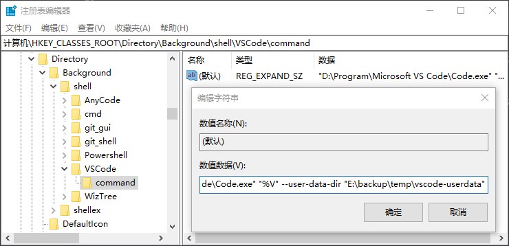

# Windows下修改VSCode工作区存储目录 workspaceStorage(容易过大)
VSCode会将每个工作区的一些配置、扩展、缓存等保存在一个默认的目录，在Windows下，此默认目录为： `%AppData%\Code\User\workspaceStorage`
> PS: `%AppData% = C:\Users\username\AppData\Roaming`

当存在多个工作空间或扩展时，需要使用大量的磁盘空间，而VSCode并没有修改workspaceStorage的配置。
如果想要将存储目录设置在磁盘空间较大的地方，可通过修改以下几个位置的VSCode快捷方式来实现。

## 快捷方式的修改
- 开始菜单路径: %AppData%\Microsoft\Windows\Start Menu\Programs\Visual Studio Code\
- 任务栏上的图标路径： %AppData%\Microsoft\Internet Explorer\Quick Launch\User Pinned\TaskBar

对目标进行修改：
`"D:\Program\Microsoft VS Code\Code.exe"` >> `"D:\Program\Microsoft VS Code\Code.exe" --user-data-dir "E:\backup\temp\vscode-userdata"`

> PS: 该目录 `"E:\backup\temp\vscode-userdata"` 权限不能过高，否则打开失败。

## 右键快捷方式修改
`win+R` >> `regedit` 打开注册表，找到`计算机\HKEY_CLASSES_ROOT\Directory\Background\shell\VSCode\command`路径下的`command`。表示的就是文件夹及内部空白处右键的操作。

修改数值数据：
`"D:\Program\Microsoft VS Code\Code.exe" "%V"` >> `"D:\Program\Microsoft VS Code\Code.exe" "%V" --user-data-dir "E:\backup\temp\vscode-userdata"`
