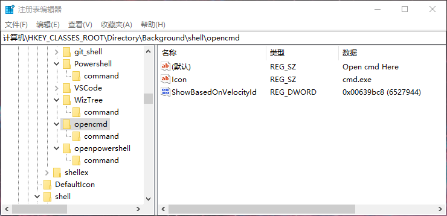
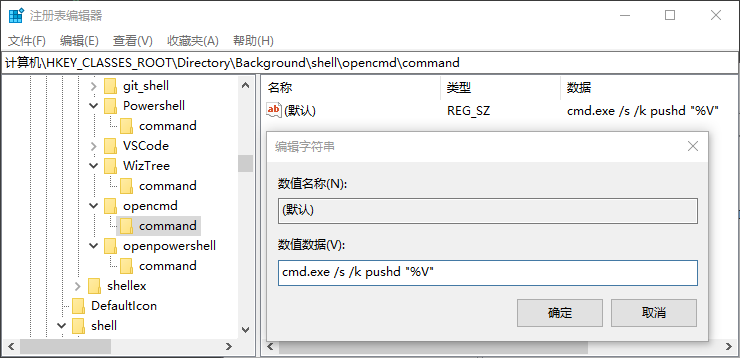
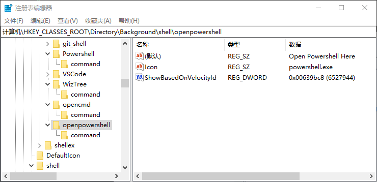
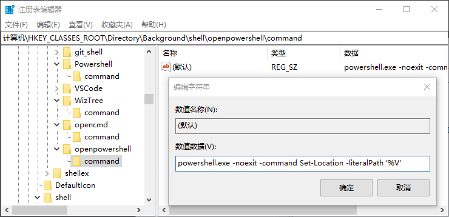
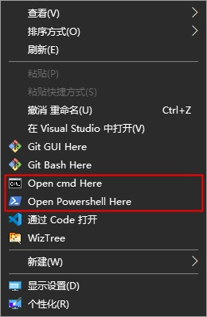

# Windows 添加右键菜单

直接运行注册表文件：`windows-add-rightmenu-shortcut.reg`
```sh
Windows Registry Editor Version 5.00

[HKEY_CLASSES_ROOT\Directory\Background\shell\opencmd]
@="Open cmd Here"
"ShowBasedOnVelocityId"=dword:00639bc8
"Icon"="cmd.exe"

[HKEY_CLASSES_ROOT\Directory\Background\shell\opencmd\command]
@="cmd.exe /s /k pushd \"%V\""

[HKEY_CLASSES_ROOT\Directory\Background\shell\openpowershell]
@="Open Powershell Here"
"ShowBasedOnVelocityId"=dword:00639bc8
"Icon"="powershell.exe"

[HKEY_CLASSES_ROOT\Directory\Background\shell\openpowershell\command]
@="powershell.exe -noexit -command Set-Location -literalPath '%V'"
```

或者直接在注册进行编辑：<br>
cmd: <br>



powershell: <br>



result: <br>
